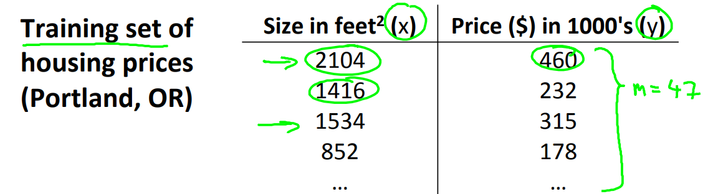
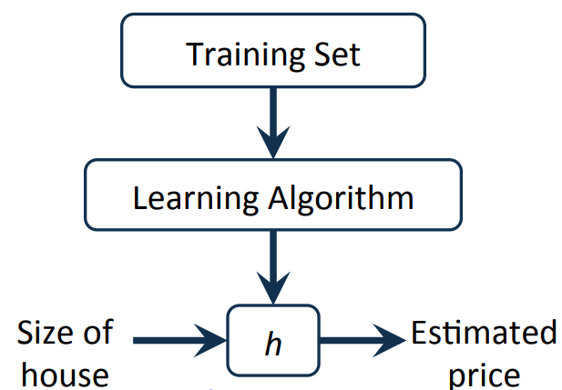
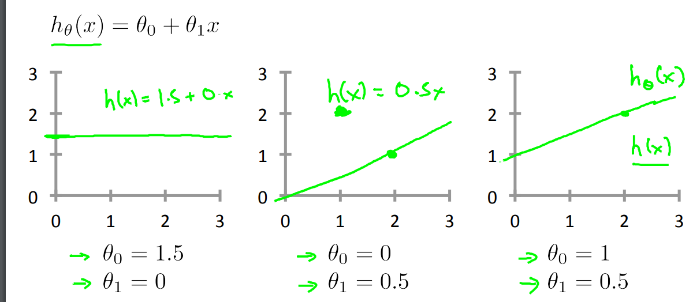
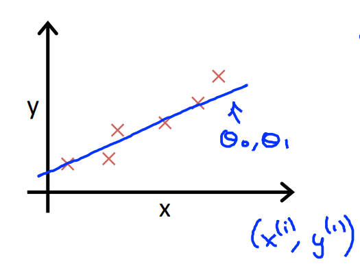
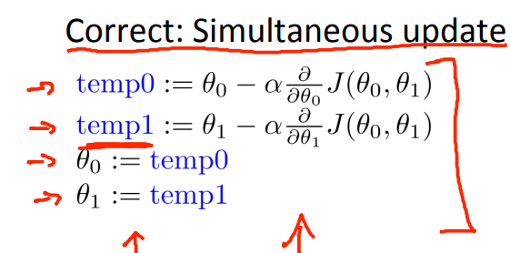
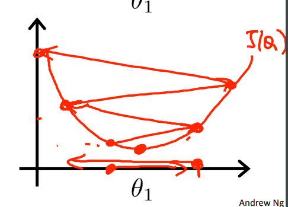
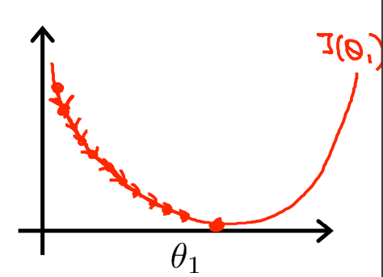
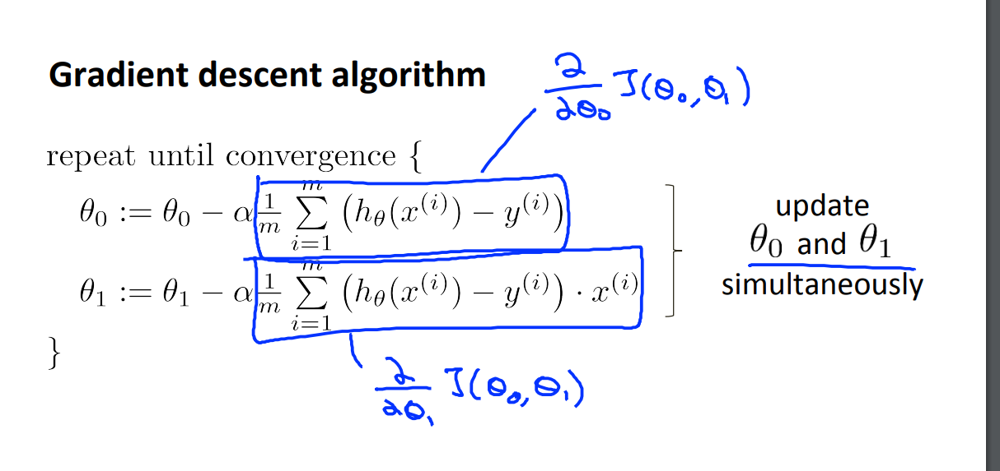

Model representation 
Linear regression with one variable

最簡單的單變量迴歸可以應用在俄勒岡州的房價預測問題上：
 

x: 是放進去模型的訓練的特徵
y: 也是放進去模型的訓練特徵，不過是我們所怠興趣的目標。

煉丹方式。。。不，是解決問題方式
以圖表示的話： 
 

 
 學渣版本解釋：
Training set: 就是丟進去訓練的數據
Learning algorithm: 由數據迭代過程
h: hypothesis ,我們想要出來的成品，能用於減少人手工作的工具。這個有點像煉丹的丹方，不同的場景下所應用的丹方並不同。
這次的h 是這樣的

那各個是怎來的？
其實和小時後求二元一次方程很像，也是把手上的的x,y放進hypothesie，再算出

 
(中二數學課即視感）

當然，真的應用上找theta 自然不會如此簡單，中二數學只會有一點，兩點，最多三點，現在是有N點在圖上。
 

y: 真實的需要預測的值，例如之前現實世界中的俄勒岡州的樓價，就屬於此。
h(x):預測的樓價。
x:特徵值，上例中的房子大小。

但是，使用模型總會出現誤差，而我們當然是想要預測的樓價模型越準越好，那麼如何做到減少誤差？

先將誤差變成公式：
一個誤差：

整個模型的誤差：

m 是有過放進去訓練的樣本數量。
這條公式叫cost function（代價涵數)和loss function 不是一回事。
ref :[link](https://www.coursera.org/learn/neural-networks-deep-learning/lecture/yWaRd/logistic-regression-cost-function) 

Andrew Ng的意思是減少整個模型的誤差使用least squares method（最小二乘法），當中本學渣想了很久都不明白為什麼要加一個1/（2m) 在公式中，直到溫習回最小二乘法。
ref:
[最小二乘法的本质是什么？ - 马同学的回答 - 知乎](https://www.zhihu.com/question/37031188/answer/411760828) 

 因為取最小二乘法時需要對代價涵數進行偏導數，故留下1/2,1/m則是因為取平均誤差所致。
 
 對使用最小二乘法後的代價涵數為：
 

 目標：
 

 
 所以，目前有：
  
 （懶的打）
 我怎麼知道我用的工具，最小二乘法可以找到$\theta_{0},\theta_{1}$ 就是最小的？
 考慮中三的數學水不，一點一點地畫在圖上
 （真的是報應，小時候最討厭畫圖了）
  
 
 左圖是假設涵數，右圖就是代價涵數。先在左圖中找到
 $$h_{\theta}(x^{i})$$
然後放去右圖中，點出右圖曲線，最後得出答案：
$$ \theta_{0} = 0, \theta_{1} =1 $$
$$minimize {\space}_{\theta_{0},\theta_{1}}  J(\theta_{0},\theta_{1}) =0 $$

如果出現很多個特徵值呢？
很多時候不會出現只有一個x的情況，所以theta也不會只有一個兩個的情況發生
 

這種情況下的最小二乘法就不太好用了。

Ａndrew Ng就介紹了梯度下降（Gradient Descent）的方法來取代最少二乘法。

課上的解釋是，所謂梯度下降就是不斷地更新兩個theta同時滅少代價涵數的方法。這個方法猶如人在下山一樣。直到達致最小值，也就是收斂（convergence)
 

同時提出了幾個新的概念：
學渣理解版：
局部最小值（local minimum)
因為數據始終有限，我們只能透過數據找到局部最小值，像人下山一樣，只能走到一個相對低的地方，不可能走到最低，沒有最低，只有更低。
全局最小值（global minimum)
傳說中，最小的代價涵數參數，但沒有人找到過，像數學求極限人一樣，只能找到無限近似值而非真確值。

將以上的概念變成公式

如多出現多個特徵值的情況下，更新的方法如下
repeat until convergence :{
$$ \theta_{j} := \theta_{j} - \alpha \frac{\partial}{\partial \theta_{j}}  J(\theta_{0},\theta_{1}) $$
}

新出現的$\alpha$是學習速率(Learning rate)，就是所謂是超參數。在這裡的作用是下山，也就更新參數的速度，$\alpha$越大，步伐越大，快是快，後果就是沒有辦法得到最小值。

$\alpha$越小，下山的速度越小，所花費的訓練模型時間就越長。

將梯度下降應用在線性迴歸時

因為每次更新參數，均所有數據計算下更新，所以稱為批量梯度下降（Batch Gradient Descent)