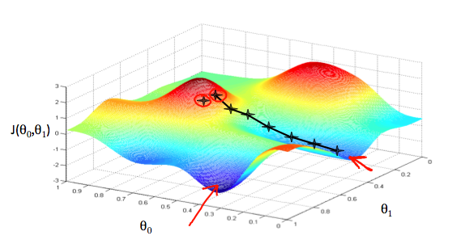
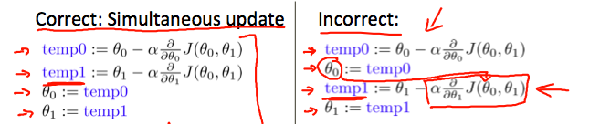
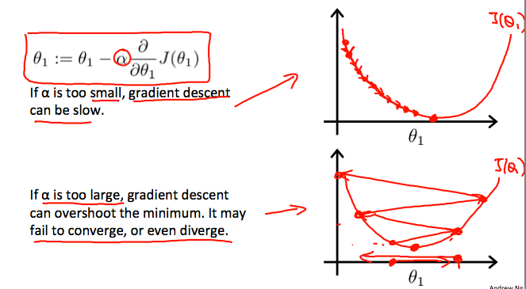

**Cost function 代價涵數**

在任何模型中，都有一個預測值，一個真實值，而在現實世界中，我們沒有一個模型能夠做到預測值與真實完全一樣，只能將預測值無限接近真實值。

預測值為：

真實值為：

整個模型的誤差為真實值與預測值之間的誤差，也就是代價涵數：

以最小二乘法（least squares method）求得最代價涵數最小為
<img src="http://latex.codecogs.com/gif.latex? $$ J(\theta_{0},\theta_{1}) = \frac{1}{2m} \sum_{i=1}^{m}  (h_{\theta}(x)^{i} - y^{i}) $$" /

*梯度下降法*
  除了最小二乘法，更多在機械學習上應用的是梯度下降法（Gradient descent)

梯度下降法是一種找出涵數的局部極小值的辧法，當中的j是feature的index number。更新重覆直到收斂為止。

  而當中的學習速率會影響收斂結果，太小會訓練速度變慢，太快則會不收斂。

